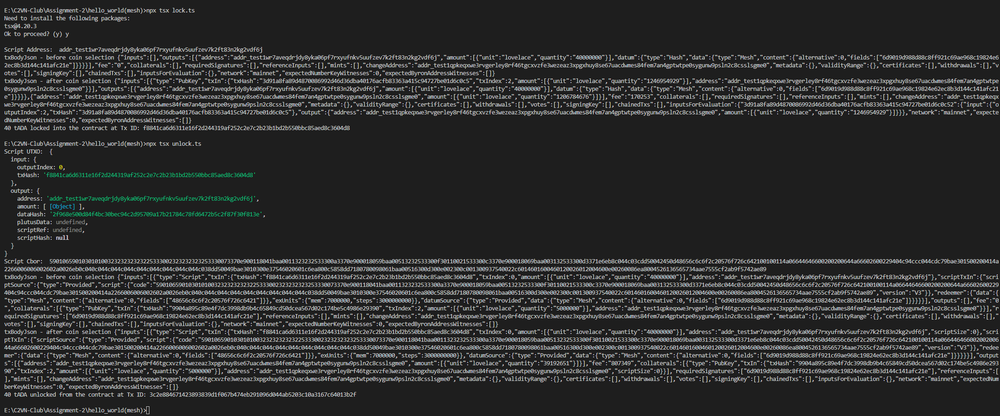

# Assignment 2

## 1. hello_world(lucid)

### Chạy files với câu lệnh:

```
deno run --env lockAssets.ts
deno run --env unlockAssets.ts
```

### Kết quả:

#### Txhash của giao dịch lock:

- Tx hash: b43216540773a1000f9ed6882b28fb6e8c849763fde3ae357f7b59cc901ccb09
- datum: d8799f581c6d9019d988d88c8ff921c69ae968c19824e62ec8b3d144c141afc21eff

#### Txhash của giao dịch unlock:

- Tx hash: 74b365a9acc236a4b75a2b89005bf488e56dff269ffaed5b5361a56874088086
- redeemer: d8799f4c48656c6c6f20776f726c6421ff


## 2. hello_world(mesh)

### Chạy files với câu lệnh:

```
npx tsx lock.ts
npx tsx unlock.ts
```

### Kết quả:

#### Txhash của giao dịch lock:

- Tx hash: f8841ca6d6311e16f2d244319af252c2e7c2b23b1bd2b550bbc85aed8c3604d8

#### Txhash của giao dịch unlock:

- Tx hash: 3c2e884671423893839d1f067b474eb291096d044ab5203c10a3167c64013b2f


